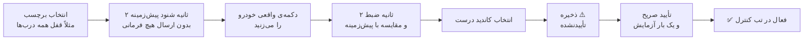
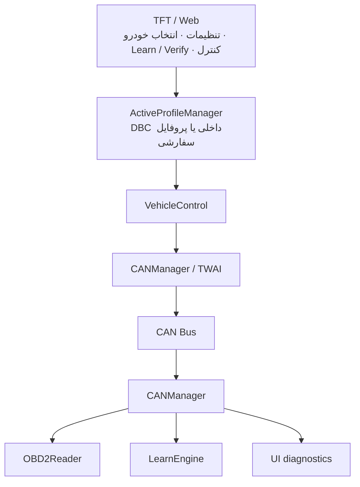

<div align="center">

<h1 dir="rtl" id="-cartouch">🚗 CarTouch</h1>

**پایش و کنترل خودرو با ESP32-S3 و CAN Bus — لمسی، وب، و یادگیرنده**


</div>

<div dir="rtl">

<div class="markdown-alert markdown-alert-warning" dir="rtl">
<p class="markdown-alert-title">Warning</p>
<p>‏CarTouch مستقیماً روی <b>CAN Bus زنده‌ی خودرو</b> کار می‌کند. ارسال یک فریم اشتباه می‌تواند باعث رفتار ناخواسته‌ی خودرو شود. توسعه و آزمایش را ابتدا روی میز و در شرایط کنترل‌شده انجام دهید، حالت <b>Listen-Only</b> را تا زمان اطمینان فعال نگه دارید و هر فرمان کنترلی را فقط روی خودرویی اجرا کنید که اختیار آزمایش آن را دارید.</p>
</div>

<h2 dir="rtl" id="-فهرست">📑 فهرست</h2>

<ol dir="rtl">
<li><a href="#-معرفی">معرفی</a></li>
<li><a href="#-وضعیت-و-محدودیتها">وضعیت و محدودیت‌ها</a></li>
<li><a href="#-learn-mode--یادگیری-فرمان-از-خودرو">Learn Mode — یادگیری فرمان از خودرو</a></li>
<li><a href="#-قطعات-مورد-نیاز">قطعات مورد نیاز</a></li>
<li><a href="#-سیمبندی">سیم‌بندی</a></li>
<li><a href="#-نصب-و-راهاندازی">نصب و راه‌اندازی</a></li>
<li><a href="#-اولین-اجرا">اولین اجرا</a></li>
<li><a href="#-معماری-و-امنیت">معماری و امنیت</a></li>
<li><a href="#-ساختار-پروژه">ساختار پروژه</a></li>
<li><a href="#-مستندات-بیشتر">مستندات بیشتر</a></li>
</ol>

---

<h2 dir="rtl" id="-معرفی">✨ معرفی</h2>

‏**CarTouch** یک سامانه‌ی embedded مبتنی بر **ESP32-S3** برای پایش و کنترل خودرو از طریق CAN Bus است. رابط اصلی دستگاه یک **TFT لمسی** است و یک **Web Dashboard** نیز از طریق Wi‑Fi در دسترس است. فرمان‌های کنترلی فقط پس از تأیید صریح شما اجرا می‌شوند.

<table dir="rtl">
<tr>
<td align="center"><b></b></td>
<td align="center"><b>قابلیت</b></td>
</tr>
<tr>
<td align="center">🎮 <b>کنترل</b></td>
<td align="center">TFT لمسی با LVGL (تب‌های Control، Dashboard، Learn و Settings) + Web Dashboard با HTTP API و WebSocket</td>
</tr>
<tr>
<td align="center">📊 <b>مانیتورینگ</b></td>
<td align="center">خواندن OBD-II با state machine <b>غیرمسدودکننده</b>؛ <code>loop()</code> اصلی هرگز روی پاسخ ECU مسدود نمی‌شود</td>
</tr>
<tr>
<td align="center">🔀 <b>Dual CAN</b></td>
<td align="center">CAN0 با TWAI و CAN1 با MCP2515 (کریستال 8 MHz)، با وضعیت، Listen-Only، diagnostics و recovery مستقل برای هر باس</td>
</tr>
<tr>
<td align="center">🎓 <b>یادگیری</b></td>
<td align="center">ضبط baseline/action، تشخیص candidate، ذخیره و چرخه‌ی تأیید؛ همچنین ورود دستی CAN ID و بایت‌ها</td>
</tr>
<tr>
<td align="center">✅ <b>چرخه‌ی تأیید</b></td>
<td align="center">فرمان‌های یادگرفته‌شده تا زمان تأیید صریح کاربر اجرا نمی‌شوند</td>
</tr>
<tr>
<td align="center">💾 <b>پروفایل خودرو</b></td>
<td align="center">انتخاب پروفایل DBC داخلی یا پروفایل سفارشی (JSON روی SPIFFS) با فهرست، import/export و مدیریت فرمان‌ها</td>
</tr>
<tr>
<td align="center">🛡️ <b>ایمنی</b></td>
<td align="center">Listen-Only، محدودیت فاصله‌ی فرمان و duty-cycle برای actuatorهای مکانیکی، توکن نشست WebSocket و ابطال نشست‌ها هنگام تغییر رمز</td>
</tr>
<tr>
<td align="center">🧾 <b>لاگ و وضعیت</b></td>
<td align="center">لاگ خطا (ring buffer + شمارنده‌های پایدار NVS) و وضعیت runtime ماژول‌ها روی TFT و Web</td>
</tr>
<tr>
<td align="center">🔋 <b>انرژی</b></td>
<td align="center">Auto Sleep پس از ۱۰ دقیقه بی‌فعالیتی و بیدار شدن بر اساس فعالیت CAN</td>
</tr>
<tr>
<td align="center">⬆️ <b>به‌روزرسانی</b></td>
<td align="center">OTA برای firmware و filesystem از طریق وب (پس از احراز هویت) و BLE OTA با رمز</td>
</tr>
<tr>
<td align="center">⚙️ <b>تنظیمات CAN</b></td>
<td align="center">تنظیم پین، bitrate و mode هر دو باس از Web، با اعتبارسنجی تداخل GPIO و اعمال پس از reboot</td>
</tr>
</table>

---

<h2 dir="rtl" id="-وضعیت-و-محدودیتها">🧭 وضعیت و محدودیت‌ها</h2>

قبل از شروع بدانید چه چیزی پشتیبانی می‌شود و چه محدودیت‌هایی وجود دارد:

<table dir="rtl">
<tr>
<td align="center"><b>موضوع</b></td>
<td align="center"><b>وضعیت</b></td>
</tr>
<tr>
<td align="center">خواندن OBD-II</td>
<td align="center">✅ فقط پاسخ‌های ISO-TP <b>Single Frame</b> برای مسیرهای پشتیبانی‌شده؛ Multi-Frame پشتیبانی نمی‌شود</td>
</tr>
<tr>
<td align="center">ولتاژ ECU</td>
<td align="center">✅ فقط از OBD PID <code>0x42</code> و در بازه‌ی ۶ تا ۳۶ ولت؛ مقدار ناموجود یا منقضی‌شده <code>N/A</code> نمایش داده می‌شود. ورودی ADC مستقل، calibration و درصد شارژ پشتیبانی نمی‌شود</td>
</tr>
<tr>
<td align="center">DTC</td>
<td align="center">⚠️ در لایه‌ی OBD وجود دارد، اما UI برای نمایش/مدیریت آن در Web/TFT ارائه نشده است</td>
</tr>
<tr>
<td align="center">Learn Mode</td>
<td align="center">⚠️ برای خودروهایی که فرمان‌های کنترلی آن‌ها <b>rolling code</b> یا مکانیزم مشابه دارند تضمین‌شده نیست</td>
</tr>
<tr>
<td align="center">پارسر DBC</td>
<td align="center">✅ Intel و Motorola؛ سقف ایمنی <b>۴۰۰ پیام</b> در هر فایل. <code>CM_</code> و <code>VAL_</code> تفسیر نمی‌شوند. هر انتخاب خودرو یک فایل DBC بارگذاری می‌کند و فایل‌های چندمنبعی به‌صورت خودکار merge نمی‌شوند</td>
</tr>
<tr>
<td align="center">DBC با شناسه‌ی Extended</td>
<td align="center">✅ با پرچم <code>isExtended</code> نگهداری می‌شوند؛ فایل‌هایی که شناسه‌ی ۲۹ بیتی را بدون bit 31 ذخیره کرده‌اند نیز تشخیص داده می‌شوند</td>
</tr>
<tr>
<td align="center">تنظیمات CAN0/CAN1</td>
<td align="center">✅ پین‌های رزروشده و تداخل GPIO بررسی می‌شود و تغییرها پس از ذخیره و reboot اعمال می‌شوند. MCP2515 با کریستال 8 MHz فقط bitrateهای 100، 125، 250، 500 و 1000 kbps را می‌پذیرد</td>
</tr>
<tr>
<td align="center">اتصال فیزیکی CAN</td>
<td align="center">⚠️ موفقیت <code>twai_driver_install()</code> یا <code>twai_start()</code> به‌تنهایی اتصال فیزیکی ترنسیور و سیم‌کشی صحیح را ثابت نمی‌کند</td>
</tr>
<tr>
<td align="center">SPIFFS</td>
<td align="center">اگر mount نشود، سیستم آن را <b>خودکار format نمی‌کند</b>؛ فایل‌های سفارشی حفظ می‌شوند و قابلیت‌های وابسته به filesystem تا رفع مشکل غیرفعال می‌مانند</td>
</tr>
<tr>
<td align="center">HTTPS</td>
<td align="center">❌ ندارد — ترافیک وب رمزنگاری نمی‌شود</td>
</tr>
<tr>
<td align="center">Secure Boot / Flash Encryption</td>
<td align="center">❌ در تنظیمات پروژه فعال نشده‌اند</td>
</tr>
<tr>
<td align="center">BLE Pairing</td>
<td align="center">⚠️ از نوع Just Works است (بدون حفاظت MITM)؛ لینک رمزنگاری می‌شود ولی هویت طرف مقابل در زمان pairing تأیید نمی‌شود. جزئیات در <a href="./BLE_OTA.md"><code>BLE_OTA.md</code></a></td>
</tr>
<tr>
<td align="center">تست روی خودرو</td>
<td align="center">بیلد CI معیار اصلی صحت کامپایل است؛ اجرای واقعی روی خودرو همچنان نیازمند سخت‌افزار و آزمون کنترل‌شده است</td>
</tr>
</table>

---

<h2 dir="rtl" id="-learn-mode--یادگیری-فرمان-از-خودرو">🎓 Learn Mode — یادگیری فرمان از خودرو</h2>

هر خودرو فرمان‌های کنترلی مخصوص خودش را دارد. Learn Mode با شنود امن (Listen-Only) فرمان را از دکمه‌ی فیزیکی خودرو یاد می‌گیرد:



<ol dir="rtl">
<li>دستگاه را به CAN Bus وصل کنید (بخش <a href="#-سیمبندی">سیم‌بندی</a>).</li>
<li>از تب «Learn» (روی TFT یا وب) یک برچسب فرمان انتخاب کنید.</li>
<li>دستگاه ۲ ثانیه پیام‌های پیش‌زمینه (baseline) را می‌شنود — <b>بدون ارسال هیچ فرمانی</b>.</li>
<li>دکمه‌ی فیزیکی خودرو را بزنید؛ دستگاه پیام‌های جدید یا تغییرکرده را ضبط می‌کند.</li>
<li>از میان کاندیدهای یافت‌شده، گزینه‌ی درست را انتخاب کنید.</li>
<li>فرمان با وضعیت «تأییدنشده» (⚠️) ذخیره می‌شود و <b>قابل اجرا نیست</b>.</li>
<li>با یک تأیید جداگانه (که CAN ID و بایت‌های واقعی را نشان می‌دهد) آن را یک‌بار آزمایش و نتیجه را دستی تأیید می‌کنید.</li>
<li>فقط پس از این مرحله، فرمان در مسیر عادی کنترل فعال می‌شود.</li>
</ol>

<blockquote dir="rtl">
<p>تشخیص کاندیدها نیمه‌خودکار است و تأیید نهایی همیشه با شماست. هیچ فرمان کنترلی از Learn Mode پیش از تأیید صریح کاربر ارسال نمی‌شود.</p>
<p>معماری، الگوریتم و قوانین ایمنی: <a href="./CarTouch_SPEC.md"><code>CarTouch_SPEC.md</code></a></p>
</blockquote>

---

<h2 dir="rtl" id="-قطعات-مورد-نیاز">🔩 قطعات مورد نیاز</h2>

<table dir="rtl">
<tr>
<td align="center"><b>قطعه</b></td>
<td align="center"><b>تعداد</b></td>
<td align="center"><b>توضیحات</b></td>
</tr>
<tr>
<td align="center"><b>ESP32-S3 DevKitC-1</b> (ماژول N16R8)</td>
<td align="center">۱</td>
<td align="center">فلش ۱۶ مگابایت + PSRAM هشت مگابایتی</td>
</tr>
<tr>
<td align="center"><b>ترنسیور CAN سه‌ولت</b> (مثل SN65HVD230)</td>
<td align="center">۱</td>
<td align="center">برای CAN0 (TWAI)</td>
</tr>
<tr>
<td align="center"><b>ماژول MCP2515</b> (کریستال 8 MHz)</td>
<td align="center">۱</td>
<td align="center">برای CAN1؛ SPI آن با TFT/Touch مشترک است</td>
</tr>
<tr>
<td align="center"><b>نمایشگر TFT با ILI9341</b></td>
<td align="center">۱</td>
<td align="center">SPI، همراه Touch Controller از نوع XPT2046</td>
</tr>
<tr>
<td align="center"><b>مبدل تغذیه</b></td>
<td align="center">۱</td>
<td align="center">ورودی تغذیه‌ی خودرو با مبدل مناسب به 3.3V</td>
</tr>
<tr>
<td align="center">سیم jumper و محفظه</td>
<td align="center">—</td>
<td align="center">برای اتصال و نصب داخل خودرو</td>
</tr>
</table>

<div class="markdown-alert markdown-alert-important" dir="rtl">
<p class="markdown-alert-title">Important</p>
<p>پروژه برای پنل <b>ILI9341</b> تنظیم شده است (<code>-DILI9341_DRIVER=1</code> در <code>platformio.ini</code>). اگر پنل شما کنترلر دیگری دارد، درایور را در <code>platformio.ini</code> عوض کنید و ابعاد رابط کاربری را با آن تطبیق دهید.</p>
</div>

---

<h2 dir="rtl" id="-سیمبندی">🔌 سیم‌بندی</h2>

<details open>
<summary><b>پین‌های ESP32-S3 برای TFT، تاچ و CAN</b></summary>

<table dir="rtl">
<tr>
<td align="center"><b>سیگنال</b></td>
<td align="center"><b>GPIO</b></td>
</tr>
<tr><td align="center">CAN0 / TWAI TX</td><td align="center">9</td></tr>
<tr><td align="center">CAN0 / TWAI RX</td><td align="center">6</td></tr>
<tr><td align="center">TFT CS</td><td align="center">10</td></tr>
<tr><td align="center">TFT DC</td><td align="center">7</td></tr>
<tr><td align="center">TFT RST</td><td align="center">4</td></tr>
<tr><td align="center">SPI MOSI</td><td align="center">11</td></tr>
<tr><td align="center">SPI MISO</td><td align="center">13</td></tr>
<tr><td align="center">SPI SCLK</td><td align="center">12</td></tr>
<tr><td align="center">TFT Backlight</td><td align="center">21</td></tr>
<tr><td align="center">Touch CS</td><td align="center">14</td></tr>
<tr><td align="center">CAN1 / MCP2515 CS</td><td align="center">15</td></tr>
<tr><td align="center">CAN1 / MCP2515 INT</td><td align="center">16</td></tr>
</table>

<blockquote dir="rtl">
<p>پین‌های نهایی را همیشه از <code>src/config.h</code> و <code>platformio.ini</code> بررسی کنید.</p>
</blockquote>

</details>

<details open>
<summary><b>CAN1 (MCP2515)</b></summary>

CAN1 از کریستال 8 MHz روی MCP2515 و SPI مشترک با TFT/Touch استفاده می‌کند. CS و INT قابل تنظیم هستند و پیش‌فرض آن‌ها GPIO15 و GPIO16 است. زمین ماژول‌ها باید مشترک باشد.

<div class="markdown-alert markdown-alert-caution" dir="rtl">
<p class="markdown-alert-title">Caution</p>
<p>GPIOهای ESP32-S3 مقاوم در برابر 5V نیستند. سطح منطقی TJA1051 به variant برد بستگی دارد و خروجی RXD نباید بیش از 3.3V به ESP32-S3 بدهد. بسیاری از بردهای MCP2515/TJA1050 با منطق 5V کار می‌کنند؛ در نبود level shifter روی خود برد، برای SCK/MOSI/CS و نیز MISO/INT مبدل سطح مناسب قرار دهید. هیچ سیگنال 5V را مستقیم به GPIO متصل نکنید.</p>
</div>

</details>

---

<h2 dir="rtl" id="-نصب-و-راهاندازی">🚀 نصب و راه‌اندازی</h2>

**پیش‌نیازها:** Git + [VS Code](https://code.visualstudio.com/) + افزونه‌ی PlatformIO

```bash
pio run -e esp32-s3-devkitc-1                 # ساخت firmware S3 با PSRAM و 16MB
pio run -e esp32-s3-devkitc-1-4mb            # ساخت firmware S3 بدون PSRAM و با پارتیشن 4MB
pio run -e esp32-c6-devkitc-1                 # ساخت firmware C6 با BLE و بدون PSRAM
pio run -e esp32-c6-devkitm-1                 # ساخت firmware C6 4MB (headless/limited storage)
pio run -e esp32-s3-devkitc-1 -t buildfs      # ساخت filesystem
pio run -e esp32-s3-devkitc-1 -t upload       # آپلود firmware
pio run -e esp32-s3-devkitc-1 -t uploadfs     # آپلود filesystem (وب و DBC)
pio device monitor                            # مانیتور سریال
```

<details>
<summary><b>بررسی کیفیت (static analysis و تست‌های native)</b></summary>

```bash
pio check -e esp32-s3-devkitc-1 --skip-packages
pio test -e native
```

</details>

<details>
<summary><b>فلش دستی با esptool (پارتیشن‌های 4MB و 16MB)</b></summary>

پروژه دو جدول پارتیشن اصلی را در اختیار دارد:

- <code>cartouch_16MB.csv</code> برای ماژول‌های ESP32-S3 با فلش 16MB و PSRAM
- <code>partitions_4MB.csv</code> برای ماژول‌های 4MB، بدون PSRAM، یا C6/limited-storage buildها

برای ماژول‌های 4MB، حافظه‌ی SPIFFS محدود است و مجموعه کامل DBCهای وب‌سایت و فایل‌های فلش‌ شده ممکن است در همان پارتیشن جا نشود. در این حالت، نسخه‌ی پایدار عبارت است از ساختار headless/limited-storage با فایل‌های ضروری و ذخیره‌سازی انعطاف‌پذیر از طریق OTA یا فایل‌های بارگذاری‌شده.

<table dir="rtl">
<tr>
<td align="center"><b>فایل</b></td>
<td align="center"><b>آدرس</b></td>
</tr>
<tr><td align="center"><code>bootloader.bin</code></td><td align="center"><code>0x0</code></td></tr>
<tr><td align="center"><code>partitions.bin</code></td><td align="center"><code>0x8000</code></td></tr>
<tr><td align="center"><code>boot_app0.bin</code></td><td align="center"><code>0xE000</code></td></tr>
<tr><td align="center"><code>firmware.bin</code></td><td align="center"><code>0x10000</code></td></tr>
<tr><td align="center"><code>spiffs.bin</code></td><td align="center"><code>0x350000</code> برای 4MB / <code>0xA10000</code> برای 16MB</td></tr>
</table>

</details>

<div class="markdown-alert markdown-alert-note" dir="rtl">
<p class="markdown-alert-title">Note</p>
<p>‏برای ماژول‌های بدون PSRAM، ساخت برنامه باید با پارتیشن 4MB و خروجی حافظه‌ی محدود انجام شود. ماژول‌های 16MB/PSRAM S3 می‌توانند نسخه کامل‌تر و حجیم‌تر را اجرا کنند؛ در برابر آن، C6 و 4MB buildها باید از سطح ذخیره‌سازی و DBCها به‌صورت محدودتر استفاده کنند.</p>
</div>

**بیلد خودکار:** workflow در `.github/workflows/CarTouch-build.yml` شامل build فریمویر و filesystem، static analysis، تست‌های native، بررسی اندازه‌ی SPIFFS و آپلود artifact است.

<details>
<summary><b>کتابخانه‌ها (خودکار توسط PlatformIO نصب می‌شوند)</b></summary>

<table dir="rtl">
<tr>
<td align="center"><b>کتابخانه</b></td>
<td align="center"><b>نسخه</b></td>
<td align="center"><b>کاربرد</b></td>
</tr>
<tr><td align="center">TFT_eSPI</td><td align="center">≥ 2.5.43</td><td align="center">درایور نمایشگر و تاچ</td></tr>
<tr><td align="center">lvgl</td><td align="center">≥ 8.4.0</td><td align="center">رابط گرافیکی</td></tr>
<tr><td align="center">ESPAsyncWebServer</td><td align="center">≥ 3.7.0</td><td align="center">وب‌سرور Async + OTA</td></tr>
<tr><td align="center">AsyncTCP</td><td align="center">≥ 3.3.0</td><td align="center">TCP Async</td></tr>
<tr><td align="center">ArduinoJson</td><td align="center">≥ 7.2.0</td><td align="center">کار با JSON</td></tr>
<tr><td align="center">NimBLE-Arduino</td><td align="center">≥ 2.3.6</td><td align="center">BLE و BLE OTA</td></tr>
<tr><td align="center">autowp-mcp2515</td><td align="center">≥ 1.3.1</td><td align="center">درایور MCP2515 برای CAN1</td></tr>
</table>

</details>

---

<h2 dir="rtl" id="-اولین-اجرا">🔑 اولین اجرا</h2>

<ol dir="rtl">
<li>دستگاه را روشن کنید و در صورت نیاز، کالیبراسیون لمسی را انجام دهید.</li>
<li>به Access Point دستگاه وصل شوید یا تنظیمات Station را انجام دهید.</li>
<li>آدرس وبی که در Serial Monitor نمایش داده می‌شود را در مرورگر باز کنید.</li>
<li>با حساب مدیریتی وارد شوید.</li>
<li><b>رمز پیش‌فرض را بلافاصله تغییر دهید.</b> رمزهای پیش‌فرض در یک نصب واقعی نباید باقی بمانند، و OTA از طریق BLE تا زمانی که رمز پیش‌فرض فعال است رد می‌شود.</li>
<li>برای آزمایش CAN ابتدا Listen-Only را نگه دارید.</li>
<li>پیش از فعال‌کردن فرمان‌های کنترلی، پروفایل خودرو را انتخاب یا ایجاد کنید و هر فرمان یادگرفته‌شده را جداگانه تأیید کنید.</li>
</ol>

---

<h2 dir="rtl" id="-معماری-و-امنیت">🏗️ معماری و امنیت</h2>

<details open>
<summary><b>جریان نرم‌افزار</b></summary>



جزئیات معماری، قراردادهای بین ماژول‌ها و محدودیت‌های ایمنی در <a href="./CarTouch_SPEC.md"><code>CarTouch_SPEC.md</code></a> نگهداری می‌شود.

</details>

<details open>
<summary><b>امنیت</b></summary>

- Listen-Only باید نقطه‌ی شروع آزمایش CAN باشد.
- فرمان‌های Learn Mode ابتدا به‌صورت تأییدنشده ذخیره می‌شوند و ارسال فرمان آزمایشی فقط از مسیر تأیید صریح انجام می‌شود.
- WebSocket بدون session token معتبر پذیرفته نمی‌شود.
- تغییر رمز، نشست‌های قبلی را بی‌اعتبار می‌کند.
- OTA فقط از مسیر احراز هویت‌شده در دسترس است.
- نبود HTTPS یعنی session و سایر داده‌های وب در شبکه‌ی محلی محرمانگی TLS ندارند.

</details>

<details>
<summary><b>DBC</b></summary>

فایل‌های DBC در <code>data/dbc/</code> داده‌ی ورودی سیستم هستند و metadata داخلی خودشان را حفظ می‌کنند. <code>VehicleDB</code> فقط فایل‌هایی را که برای انتخاب مستقیم مناسب تشخیص داده شده‌اند به فهرست خودروها متصل می‌کند؛ فایل‌های دیگر ممکن است برای merge چندمنبعی، ADAS/radar یا ساختارهای خاص نگهداری شده باشند.

</details>

<details>
<summary><b>وضعیت Runtime و ماژول‌ها</b></summary>

وضعیت runtime ماژول‌های Wi-Fi، Web Server، CAN Bus، OBD-II، Touch، Display، BLE و Storage روی TFT و Web UI نمایش داده می‌شود. وضعیت‌ها شامل <code>DETECTED</code>، <code>INITIALIZING</code>، <code>READY</code>، <code>NOT DETECTED</code>، <code>ERROR</code> و <code>DISABLED</code> هستند. CAN diagnostics شامل شمارنده‌های RX/TX، خطا و وضعیت bus است. قطع یک ماژول نباید boot کل دستگاه را متوقف کند.

</details>

<details>
<summary><b>OTA و BLE</b></summary>

OTA برای firmware و filesystem از Web UI فعال است. BLE مستقل از Wi-Fi اجرا می‌شود و status و BLE OTA دارد؛ کنترل مدیریتی BLE محدود به پروتکل تعریف‌شده است. نسخه‌ی firmware از <code>CAR_TOUCH_FIRMWARE_VERSION</code> در <code>src/config.h</code> می‌آید. پروتکل کامل در <a href="./BLE_OTA.md"><code>BLE_OTA.md</code></a>.

</details>

---

<h2 dir="rtl" id="-ساختار-پروژه">📂 ساختار پروژه</h2>

<div dir="ltr">

```
CarTouch/
├── platformio.ini                # تنظیمات PlatformIO، پین‌ها و کتابخانه‌ها
├── cartouch_16MB.csv             # جدول پارتیشن ۱۶ مگابایتی
├── README.md                     # همین فایل
├── CarTouch_SPEC.md              # مشخصات فنی و معماری
├── BLE_OTA.md                    # پروتکل BLE و BLE OTA
├── LICENSE
├── .github/workflows/            # بیلد خودکار در GitHub Actions
├── src/
│   ├── main.cpp                  # setup + loop
│   ├── config.cpp/.h             # پین‌ها، ثابت‌ها، تنظیمات
│   ├── can_manager.cpp/.h        # مدیریت CAN0 (TWAI)
│   ├── can_service.cpp/.h        # مسیریابی بین CAN0 و CAN1
│   ├── mcp2515_can_interface.*   # درایور CAN1 (MCP2515)
│   ├── can_interface.h           # رابط مشترک باس‌ها
│   ├── obd2_reader.cpp/.h        # خواندن OBD-II (غیرمسدودکننده)
│   ├── vehicle_control.cpp/.h    # اجرای فرمان‌ها
│   ├── vehicle_db.cpp/.h         # پارسر DBC (Intel + Motorola)
│   ├── tft_ui.cpp/.h             # رابط لمسی LVGL
│   ├── webserver.cpp/.h          # وب‌سرور + WebSocket + OTA
│   ├── wifi_manager.cpp/.h       # Wi-Fi (AP/STA)
│   ├── ble_manager.cpp/.h        # BLE و BLE OTA
│   ├── module_status.cpp/.h      # وضعیت runtime ماژول‌ها
│   ├── custom_vehicle.h          # ساختار پروفایل‌های سفارشی
│   ├── custom_vehicle_store.*    # ذخیره JSON در SPIFFS
│   ├── learn_engine.*            # موتور یادگیری (capture/diff)
│   ├── active_profile_manager.*  # یکپارچه‌ساز DBC + سفارشی
│   ├── error_log.*               # لاگ خطا و شمارنده‌های پایدار
│   └── ct_*.h                    # parserها و validationهای مستقل از سخت‌افزار
├── test/test_native/             # تست‌های native
└── data/                         # محتوای SPIFFS
    ├── index.html, style.css, app.js   # Web Dashboard
    ├── dbc/                            # فایل‌های DBC
    └── custom_vehicles/                # در زمان اجرا ساخته می‌شود (نه در سورس)
```

</div>

---

<h2 dir="rtl" id="-مستندات-بیشتر">📚 مستندات بیشتر</h2>

<table dir="rtl">
<tr>
<td align="center"><b>فایل</b></td>
<td align="center"><b>چه چیزی در آن هست</b></td>
</tr>
<tr>
<td align="center"><a href="./CarTouch_SPEC.md"><code>CarTouch_SPEC.md</code></a></td>
<td align="center">معماری ماژول‌ها، Learn Mode و verification، Listen-Only، DBC، قراردادهای ایمنی و تست</td>
</tr>
<tr>
<td align="center"><a href="./BLE_OTA.md"><code>BLE_OTA.md</code></a></td>
<td align="center">پروتکل BLE و BLE OTA و نکات امنیتی آن</td>
</tr>
</table>

**مجوز:** MIT — متن کامل در `LICENSE`.

</div>
